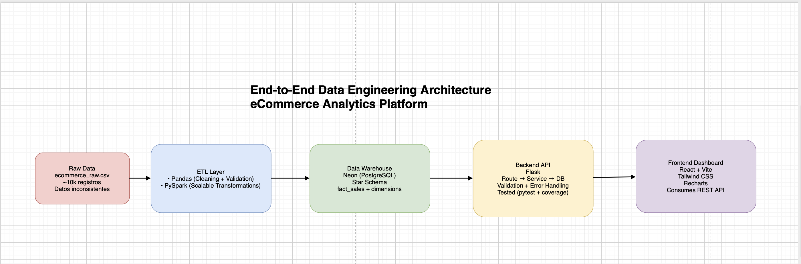

# Ecommerce Data Engineering Project

[](https://github.com/yagoalonsodev/ecommerce-data-engineering-project/actions/workflows/ci.yml)
[](https://www.python.org/)
[](https://pandas.pydata.org/)
[](https://spark.apache.org/)
[](https://neon.tech/)
[](https://flask.palletsprojects.com/)
[](https://react.dev/)
[](https://vitejs.dev/)
[](https://tailwindcss.com/)
[](https://recharts.org/)
[](https://pytest.org/)
[](https://www.docker.com/)
[](https://www.netlify.com/)
[](https://vercel.com/)

Plataforma de ingeniería de datos end-to-end para análisis eCommerce: pipelines ETL con Pandas y PySpark, modelo dimensional en PostgreSQL (Neon), API REST con Flask, dashboard en React, tests con cobertura y CI/CD.

---

## Stack

| Área | Tecnologías |
|------|-------------|
| **Datos** | Pandas, PySpark, Neon (PostgreSQL) |
| **Backend** | Flask, Flask-CORS, psycopg2, Route → Service → DB |
| **Frontend** | React 18, Vite 5, Tailwind CSS, Recharts |
| **Tests** | pytest, pytest-cov, GitHub Actions |
| **Deploy** | Netlify (frontend), Vercel (backend API) |

---

## Enlaces

- **Dashboard (producción):** [ecommerce-etl.netlify.app](https://ecommerce-etl.netlify.app)
- **API (producción):** [ecommerce-data-engineering-project-chi.vercel.app](https://ecommerce-data-engineering-project-chi.vercel.app)

---

## 🏗 Arquitectura

<p align="center">
  
</p>

```
Raw CSV (~10k registros con inconsistencias)
        │
        ▼
ETL Layer
  - Pandas (limpieza rápida, validaciones)
  - PySpark (transformación escalable)
        │
        ▼
Data Warehouse
  - Neon (PostgreSQL)
  - Modelo estrella (fact_sales + tablas dim)
        │
        ▼
Backend API
  - Flask
  - Arquitectura Route → Service → DB
  - Validación de parámetros
  - Manejo de errores (400, 404, 500)
  - Endpoint /health
        │
        ▼
Frontend Dashboard
  - React + Vite
  - Tailwind CSS
  - Recharts
  - Consumo de API REST
```

**Production Deployment:**
- Frontend → Netlify
- Backend → Vercel
- Database → Neon (PostgreSQL)

---

## Decisiones técnicas

| Decisión | Motivo |
|----------|--------|
| **Pandas y PySpark** | Pandas para limpieza rápida y validaciones; PySpark para simular un entorno distribuido y escalable. |
| **Neon (PostgreSQL)** | Base relacional adecuada para modelo dimensional; serverless y fácil de desplegar en producción. |
| **Route → Service → DB** | Separación de responsabilidades, facilita testing con mocks y escalado a microservicios. |
| **Tests sin base real** | Tests rápidos, CI independiente del entorno y aislamiento de la lógica de negocio. |

---

## Limitaciones actuales

- No hay autenticación (API pública).
- No hay paginación real.
- No hay rate limiting.
- No hay caching.
- El ETL no está orquestado automáticamente (se ejecuta manualmente).

---

## Métricas del proyecto

- ~10.000 registros procesados
- 2 pipelines ETL (Pandas + PySpark)
- 6 endpoints REST (incl. `/health`)
- 37+ tests automatizados
- CI con cobertura (pytest-cov)
- Deploy en producción (Netlify + Vercel)

---

## Cómo arrancar en local

### Con Docker

```bash
docker-compose up -d ecommerce-etl frontend
docker-compose exec -d ecommerce-etl bash -c "cd /app && PYTHONPATH=. flask --app backend.app run --host=0.0.0.0 --port=5000"
```

- **Dashboard:** http://localhost:3000  
- **API:** http://localhost:5001  

### Sin Docker (desarrollo)

**Backend:**

```bash
pip install -r requirements.txt
export DATABASE_URL="postgresql://..."   # o usa .env
PYTHONPATH=. flask --app backend.app run --port=5001
```

**Frontend:**

```bash
cd frontend
npm install
npm run dev
```

Abre http://localhost:5173 (el front usa `VITE_API_BASE` o fallback a `http://localhost:5001` en dev).

---

## Tests

```bash
pip install -r requirements.txt
PYTHONPATH=. pytest backend/tests tests/etl -v --cov=backend --cov=data_engineering --cov-report=term-missing
```

---

## Deploy

### Frontend (Netlify)

- **Base directory:** `frontend`
- **Build command:** `npm run build`
- **Publish directory:** `dist`
- **Variable de entorno:** `VITE_API_BASE` = URL del backend (ej. `https://tu-proyecto.vercel.app`), sin barra final.

### Backend (Vercel)

- **Root directory:** `backend`
- **Install command:** `pip install -r requirements.txt`
- **Variables de entorno:**
  - `DATABASE_URL` = URL de conexión Neon (PostgreSQL).
  - `FRONTEND_ORIGIN` = URL del frontend en Netlify (ej. `https://tu-app.netlify.app`) para CORS.

---

## Estructura del proyecto

```
├── backend/          # API Flask (rutas, servicios, DB)
├── config/           # Settings, variables de entorno
├── data_engineering/ # ETL Pandas + PySpark
├── frontend/         # React + Vite + Tailwind + Recharts
├── tests/           # Tests ETL y backend
├── docker-compose.yml
└── requirements.txt  # Dependencias Python (raíz)
```

---

## Licencia

MIT
